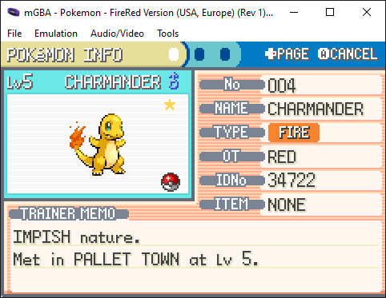

## Automated shiny hunting

Given running [mGBA](https://github.com/mgba-emu/mgba) processes with save files standing before your starter of choice, this program repatedly sends keystrokes to collect the starter, check its stats, and reset until a shiny is found.

## Detection technique

The shiny ⭐ icon on the Pokemon's status page is detected by looking for its color of <span style="color: rgb(255, 214, 82)">rgb(255, 214, 82)</span> at expected pixel coordinates in a screenshot. When found, the program exits, leaving the emulator running and awaiting further input.

## Usage

```cmd
> start mGBA.exe "path_to_pokemon_fire_red.gba"
> start mGBA.exe "path_to_pokemon_fire_red.gba"
> dotnet run --project .\ShinyHunter\ShinyHunter.csproj
```



## Why not just use PKHeX?

Because this is more fun.

## Potential enhancements

* Support unbounded fast-forward speed
* Make process less timing-based/reliant on repeating key presses
* Other shiny hunt scenarios (breeding, random encounters)
